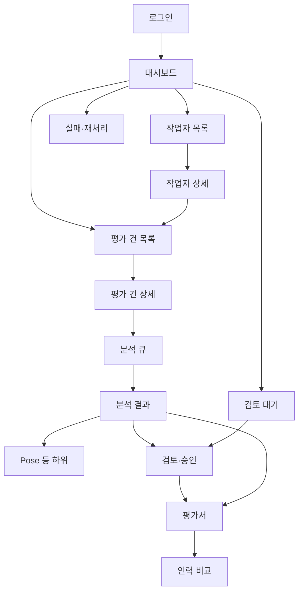

# 03 · 화면 목록 · 클릭 → 이동 (v0.2)

> 구현 전 합의용. 경로·라벨은 [02-ia-menu.md](./02-ia-menu.md) 와 동일 전제.

---

## 1. 화면 목록 (P0 = 첫 배포에 필수)

| ID | 화면 | 경로 | P0 | 주 역할 |
|----|------|------|:--:|---------|
| S01 | 로그인 | `/login` | ● | 공통 |
| S02 | 대시보드 | `/` | ● | 공통(위젯 다름) |
| S03 | 작업자 목록 | `/workers` | ● | company, admin |
| S04 | 작업자 등록 | `/workers/new` | ● | company, admin |
| S05 | 작업자 상세 | `/workers/[id]` | ● | 공통 |
| S06 | 평가 건 목록 | `/jobs` (또는 `/cases`) | ● | company, admin |
| S07 | 평가 건 상세·업로드 | `/jobs/[id]` | ● | company, admin |
| S08 | 분석 큐·상태 | `/analysis/queue` | ● | evaluator, admin |
| S09 | 분석 결과 종합 | `/analysis/[id]` | ● | 공통 |
| S10 | Pose | `/analysis/[id]/pose` | ● | 공통 |
| S11 | 작업 시간 | `/analysis/[id]/time` | ○ | 공통 |
| S12 | 반복 패턴 | `/analysis/[id]/repetition` | ○ | 공통 |
| S13 | 결과물 | `/analysis/[id]/product` | ○ | 공통 |
| S14 | 검토 대기 목록 | `/reviews` | ● | evaluator, admin |
| S15 | 검토·승인 | `/reviews/[id]` 또는 분석 하위 | ● | evaluator, admin |
| S16 | 평가서 목록 | `/reports` | ● | 공통 |
| S17 | 평가서 | `/reports/[id]` | ● | 공통 |
| S18 | 인력 비교 | `/compare` | ○ | company, admin |
| S19 | 직종별 현황 | `/job-types` | ○ | admin |
| S20 | 실패·재처리 | `/ops/failures` | ● | admin |
| S21 | 평가 기준 | `/settings/criteria` | — | admin |
| S22 | 사용자·권한 | `/settings/users` | — | admin |

● P0 · ○ P1 · — 이후

---

## 2. 핵심 클릭맵

### 2.1 사이드바 → 화면

| 클릭 | 이동 |
|------|------|
| 대시보드 | `/` |
| 작업자 | `/workers` |
| 평가 건 / 영상 | `/jobs` |
| 분석 큐 / 상태 | `/analysis/queue` |
| 검토 대기 | `/reviews` |
| 평가서 | `/reports` |
| 인력 비교 | `/compare` |
| 직종별 현황 | `/job-types` |
| 실패·재처리 | `/ops/failures` |
| 로그아웃 | `/login` |

### 2.2 대시보드

| 클릭 | 이동 |
|------|------|
| KPI · 분석 실패 | `/ops/failures` |
| KPI · 검토 대기 | `/reviews` |
| 최근 건 · 작업자명 | `/workers/[id]` |
| 최근 건 · 결과 | `/analysis/[videoId]` (완료) |
| 최근 건 · 상태 | `/analysis/queue` 또는 해당 건 상세 |
| CTA · 작업자 등록 | `/workers/new` |
| CTA · 영상 업로드 | `/jobs` (업로드 포커스) 또는 `/jobs/new` |
| CTA · 검토 시작 | `/reviews` → 첫 대기 건 |

### 2.3 작업자

| 클릭 | 이동 |
|------|------|
| 행 / 상세 | `/workers/[id]` |
| 등록 | `/workers/new` |
| 저장 후 | `/workers/[id]` |
| 상세 · 영상/평가 행 | `/analysis/[videoId]` 또는 `/jobs/[id]` |
| 상세 · 평가서 | `/reports/[videoId]` |

### 2.4 평가 건 · 분석

| 클릭 | 이동 |
|------|------|
| 목록 행 | `/jobs/[id]` 또는 완료 시 `/analysis/[videoId]` |
| 분석 요청 | 상태 → 큐 (`/analysis/queue`) |
| 서브탭 Pose 등 | `/analysis/[id]/…` |
| 검토하기 | `/reviews/[id]` |
| 평가서 보기 | `/reports/[id]` |
| 매칭 카드 · 비교 | `/compare?ids=…` (있으면) |

### 2.5 검토 · 평가서

| 클릭 | 이동 |
|------|------|
| 검토 대기 행 | `/reviews/[id]` |
| 승인 완료 | `/reports/[id]` 또는 목록 |
| 평가서 인쇄/PDF | 동일 화면 액션 (라우트 유지) |
| 목록으로 | `/reports` |

### 2.6 실패·재처리

| 클릭 | 이동 |
|------|------|
| 재분석 | 해당 건 큐 상태 갱신 · `/analysis/queue` |
| 작업자/영상 | `/workers/[id]`, `/jobs/[id]` |

---

## 3. 상태별 기본 랜딩 (행 클릭 규칙)

평가 건·최근 분석 리스트에서 **상태 → 기본 목적지**를 고정한다.

| 상태 | 기본 이동 |
|------|-----------|
| 대기열 / 업로드됨 | `/jobs/[id]` |
| 분석 중 · 포즈추출 등 | `/analysis/queue` (또는 건 상세 진행 UI) |
| 완료 (미검토) | `/analysis/[id]` → CTA 검토 |
| 검토 완료·승인 | `/reports/[id]` |
| 실패 | `/ops/failures` 해당 행 또는 건 상세 오류 |

v0.1처럼 completed만 `/analysis`, 나머지 전부 `/analysis/status`로 뭉개지 않는다.

---

## 4. 플로우 다이어그램

---

## 5. v0.1 대비 “누르면 달라지는” 요약

| 행동 | v0.1 | v0.2 |
|------|------|------|
| 사이드바 2. 작업자 | 항상 W-001 | 작업자 **목록** |
| 사이드바 3. AI 분석 | 항상 V-101 | 메뉴 삭제 → 목록/상세에서 진입 |
| 사이드바 4. Pose | 탑레벨 | 분석 **서브탭**만 |
| 홈 시연 시작 | W-001 | 역할별 업무 CTA |
| 최근 분석 · 미완료 | 전부 status | 상태별 랜딩 규칙 |
